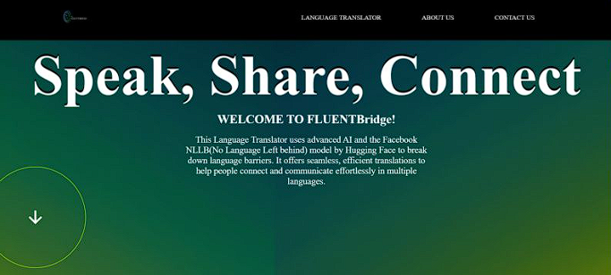
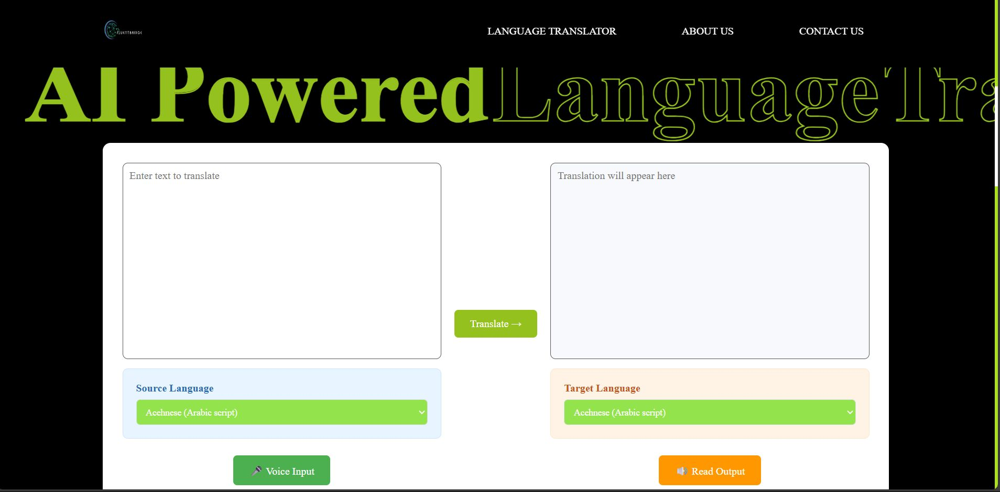
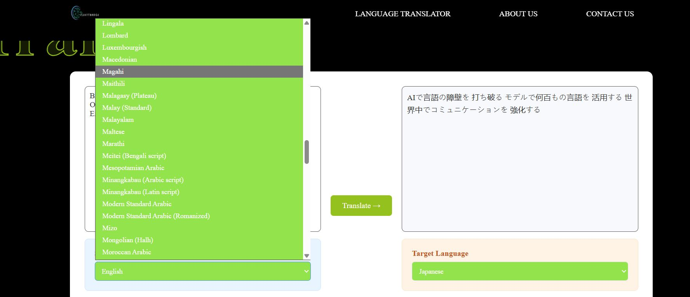
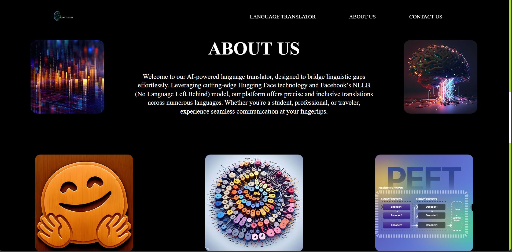

# 🌍 AI-Powered Language Translator

This project is a cutting-edge language translation web application built using Meta’s No Language Left Behind (NLLB) model, accessed via Hugging Face. The NLLB model is a state-of-the-art transformer designed to translate between over 200 languages with high accuracy. By leveraging this powerful multilingual model, the application delivers fast, reliable, and context-aware translations through a clean, user-friendly interface.

## 🔍 Overview

This project leverages Meta’s [NLLB model](https://huggingface.co/facebook/nllb-200-distilled-600M) from Hugging Face to perform **real-time multilingual translations** in a lightweight web interface.

## ✨ Features

- 🌐 Translate between 200+ languages
- ⚡ Fast and accurate translation with state-of-the-art transformer model
- 🖥️ Simple web-based UI built using HTML/CSS/JS
- 🐍 Python backend using Flask

## 🧠 Model Info

- **Model:** NLLB-200 (distilled)
- **Framework:** Hugging Face Transformers
- **Source:** [Hugging Face Model Hub](https://huggingface.co/facebook/nllb-200-distilled-600M)

## 🚀 Getting Started

1. Clone the Repository
git clone https://github.com/DYUTIMAN03/AI-Powered-Language-Translator-.git
cd AI-Powered-Language-Translator-

2. Create a Virtual Environment
python -m venv .venv

3. Activate the Environment on Windows:
.venv\Scripts\activate

4. Install Dependencies
pip install -r requirements.txt

5. Run the App
python app.py

## ✨ Project Snapshots

## ✨ Project Snapshots

<table>
  <tr>
    <td align="center">
       
      <b>🌐 Input Interface</b>
    </td>
    <td align="center">
       
      <b>🈯 Language Selection</b>
    </td>
  </tr>
  <tr>
    <td align="center">
       
      <b>✅ Translated Output</b>
    </td>
    <td align="center">
       
      <b>🚀 Confirmation</b>
    </td>
  </tr>
</table>

🙋‍♂️ Author

Developed and maintained by Dyutiman Bharadwaj
